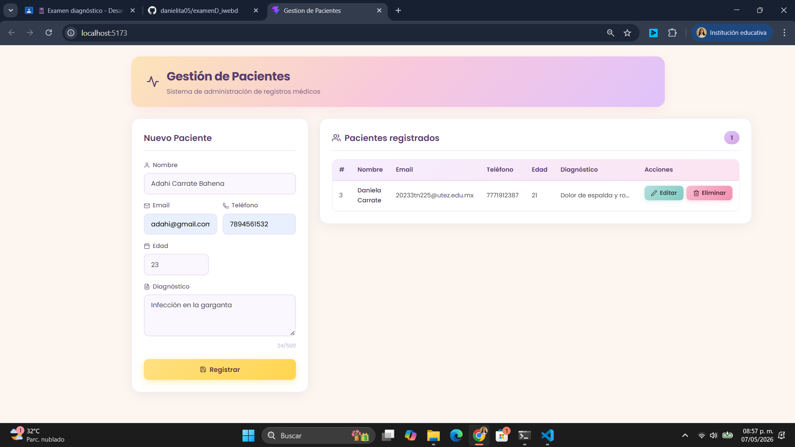
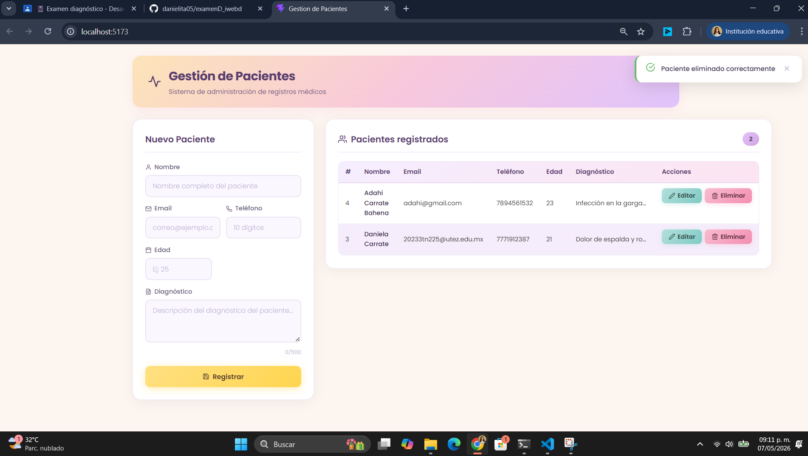
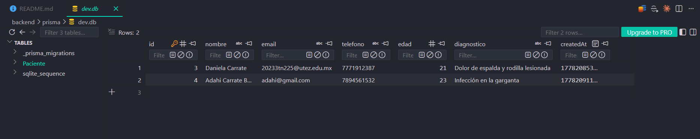

# Sistema de Gestion de Pacientes

Aplicacion web tipo CRUD para la gestion de pacientes medicos. Permite registrar, consultar, editar y eliminar registros de pacientes con validaciones en frontend y backend.

## Tecnologias utilizadas

- **Frontend:** React 18 + TypeScript + Vite
- **Backend:** NestJS + TypeScript
- **ORM:** Prisma 5
- **Base de datos:** SQLite
- **Validacion:** class-validator (backend) + validacion manual (frontend)
- **HTTP Client:** Axios

## Funcionalidades

- **Registrar** nuevos pacientes con validaciones completas en cada campo
- **Consultar** la lista de todos los pacientes registrados
- **Editar** los datos de pacientes existentes
- **Eliminar** pacientes con confirmacion previa

### Campos del registro

| Campo | Tipo | Validacion |
|-------|------|------------|
| Nombre | Texto | Requerido, solo letras y espacios, 3-100 caracteres |
| Email | Texto | Requerido, formato email valido, unico |
| Telefono | Texto | Requerido, exactamente 10 digitos |
| Edad | Numero | Requerido, entre 1 y 120 |
| Diagnostico | Texto | Requerido, 5-500 caracteres |

## Instrucciones para ejecutar el proyecto

### Prerrequisitos

- Node.js v18 o superior
- npm
- (Opcional) Extension de VS Code **SQLite Viewer** de Florian Klampfer para visualizar la base de datos directamente desde el editor

### 1. Clonar el repositorio

```bash
git clone https://github.com/danielita05/examenD_iwebd.git
cd examenD_iwebd
```

### 2. Configurar y ejecutar el backend

```bash
cd backend
npm install
npx prisma migrate dev --name init
npm run start:dev
```

El backend estara disponible en `http://localhost:3000`

### 3. Configurar y ejecutar el frontend

En otra terminal:

```bash
cd frontend
npm install
npm run dev
```

El frontend estara disponible en `http://localhost:5173`

## Estructura del proyecto

```
examenD_iwebd/
├── backend/                  # API REST con NestJS
│   ├── prisma/
│   │   └── schema.prisma     # Modelo de datos
│   └── src/
│       ├── pacientes/        # Modulo CRUD de pacientes
│       │   ├── dto/          # Validaciones con class-validator
│       │   ├── pacientes.controller.ts
│       │   ├── pacientes.service.ts
│       │   └── pacientes.module.ts
│       ├── prisma.service.ts # Servicio de conexion a BD
│       ├── app.module.ts
│       └── main.ts
├── frontend/                 # Interfaz con React + Vite
│   └── src/
│       ├── components/       # Componentes (formulario, tabla)
│       ├── services/         # Servicio API con Axios
│       ├── types/            # Tipos TypeScript
│       ├── App.tsx           # Componente principal
│       └── main.tsx
└── README.md
```

## Evidencias

### Registro de un nuevo paciente
Se llena el formulario con los datos del paciente y se presiona "Registrar". El sistema valida cada campo en tiempo real antes de guardar.



### Editar paciente - antes de modificar
Al presionar "Editar" en la tabla, los datos del paciente se cargan en el formulario. El boton "Actualizar" permanece deshabilitado hasta que se realice un cambio.


### Editar paciente - despues de modificar
Una vez modificados los datos, se habilita el boton "Actualizar" y al presionarlo se guardan los cambios. Se muestra una notificacion de confirmacion.


### Confirmacion de eliminacion
Al presionar "Eliminar", se muestra un modal personalizado pidiendo confirmacion antes de proceder con la eliminacion del registro.


### Paciente eliminado
Despues de confirmar la eliminacion, el registro se remueve de la tabla y se muestra una notificacion de exito.



### Base de datos SQLite
Vista de la base de datos SQLite usando la extension SQLite Viewer de Florian Klampfer en VS Code, donde se pueden ver los registros almacenados.



## Uso de IA

Se utilizo Claude (IA de Anthropic) como herramienta de asistencia para:
- Generacion de la estructura base del proyecto
- Configuracion de Prisma con SQLite
- Creacion de validaciones en DTOs y formulario

La estudiante comprende el funcionamiento general del proyecto y puede explicar cada parte del codigo. 👀

## Autora

**Daniela Carrate Bahena** - 9 "C" IDGS
